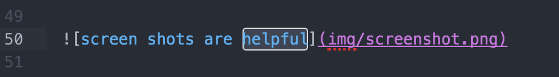

# CS52 Workshops:  TITLE OF YOUR WORKSHOP


Brief motivation here as well as in presentation

## Overview

Summary of what we're about to do.

## Setup

Any necessary setup steps

## Step by Step

* Explanations of the what **and** the why behind each step. Try to include:
  * higher level concepts
  * best practices

Remember to explain any notation you are using.

```javascript
/* and use code blocks for any code! */
```



:sunglasses: GitHub markdown files [support emoji notation](http://www.emoji-cheat-sheet.com/)

Here's a resource for [github markdown](https://guides.github.com/features/mastering-markdown/).


## Summary / What you Learned

* [ ] can be checkboxes

## Resources

* cite any resources
